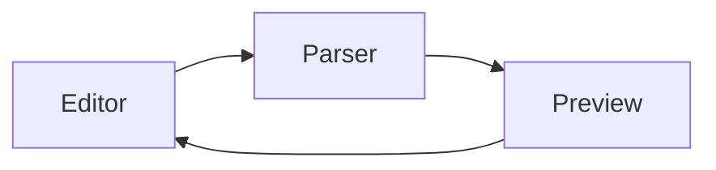

# Welcome to MDLive ✨

A **live** markdown editor with *real-time* preview.

## Features

- **Bold**, *italic*, ~~strikethrough~~, and <u>underline</u>
- Headings, blockquotes, and code blocks
- Emoji picker 😎
- Mermaid diagrams
- Image & video embeds
- Multi-language support
- Dark & light themes

> "The best way to predict the future is to invent it." — Alan Kay

### Code Block

```javascript
function hello() {
  console.log("Hello, MDLive!");
}
```

### Mermaid Diagram



### Table

| Feature | Status |
|---------|--------|
| Bold | ✅ |
| Emoji | ✅ |
| Themes | ✅ |

---

Start editing to see the magic! 🚀
---

### Dark Mode


### Light Mode


### Live Demo
[](https://youtu.be/rhgOjDfFwhc)


🌐 [Deployment](https://www.md-live.netlify.app)
💻 [Source Code](https://www.github.com/teguh-anggar/mdlive) 
